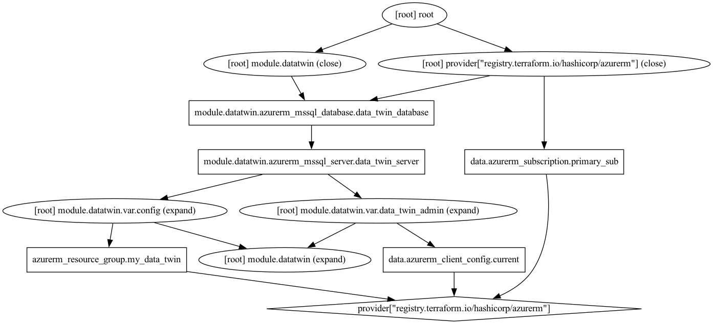

<!-- BEGIN_TF_DOCS -->
# This is the autogenerated documentation

# Documention with terraform-docs

This will be the header of the project, if is derived from this comment.
You can use markdown syntax to add some **format**

- and even
- list are
- possible

## Providers

| Name | Version |
|------|---------|
|  [azurerm](#provider\_azurerm) | 3.40.0 |

## Inputs

No inputs.

## Outputs

No outputs.

## Graphical Visualisation of Terraform dependency graph

This visual is created using `terraform graph` and the GraphViz library

<!-- END_TF_DOCS -->

